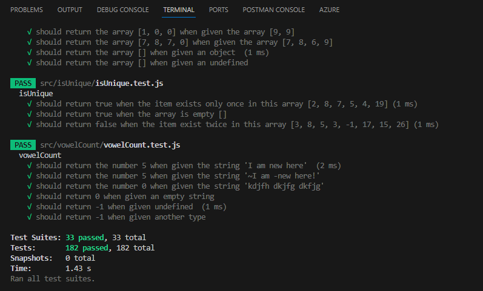
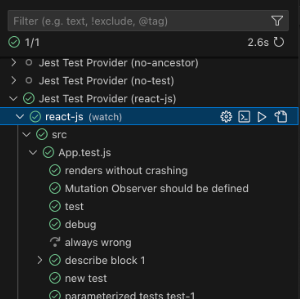

# javascript-algorithms

# Summary

This project compiles a variety of javascript algorithms that I practiced. It is split into 2 parts:

- In the `src` folder: a variety of functions and corresponding tests using **javascript**, **node.js** and the **jest** testing package.
- In the `other` folder: a variety of algorithm questions found on the net. These are grouped by theme and each theme has 2 files: a file containing the questions only, and a corresponding file where I saved my answers (most of them I worked online in a coding platform like **codepen** or in the browser).

## The SRC Folder structure

All works that are tested using jest are located in the `src` folder. The `src` folder contains a folder per function/algorithms. The names of the folders match the items listed below.

Each algorithm folder contains at least a readme with more explanations for the specific algorithm, a .js file with the function and a .test.js for the corresponding jest testing.
Note: some algorithms might have two functions (and each their corresponding tests) when I attempted two different solutions.

If you'd like to practice resolving an algorithm, I suggest to open the algorithm's readme, then create a new .js file in that folder where you can create a function with the same name as the one mentioned in the readme. To check if your function works, you can export your function at the end of your file, and adjust the import at the top of the .test.js file so that it imports your function instead of mine. That way, the tests will display the results for your function (and not mine).

### Numbers

- **oddOrEven**: check if number is odd or event
- **isPerfectSquare**: check if a number is a perfect square number or not
- **isPrimeNumber**: check if a number is a prime number
- **factorial**: returns the factorial of a given positive number, or 1 when given 0, or undefined when given a negative number
- **mostSongs**: return the maximum number of elements present in the array, with a maximum sum of 60
- **fizzBuzz**: goes through the numbers 1 to 100 and for each number: replaces it by `Fizz` if the number is divisable by num1, replaces it by `Buzz` if the number is divisable by num2, replaces it by `FizzBuzz` if the number is divisable by both num1 and num2, or keeps the number itself, and then returns the complete string of results for all numbers.
- **roman**: reads a given roman number string and returns its corresponding integer value.
- **plusOne**: takes an array of digits representing a number, adds 1 to the number and returns an updated array of digits.
- **totalGoals**: takes a team name as a string and checks a data object to extract the total number of goals scored by this team.

### Strings

- **isAnagram**: check if two strings are anagrams (same letters)
- **isPalindrome**: check if a string is a palindrome (same word when written backwards)
- **camelCase**: changes the format of a string to a camel case format
- **titleCase**: changes the format of a string to a title case format
- **characterCount**: takes a string and returns an object containing the characters in the string and the number of times they appear
- **vowelCount**: returns the total number of vowels present in a string
- **endsWith**: checks if the end of a given string matches a given target
- **oneEditAway**: checks if two strings are exactly one edit away from each other (one character difference)
- **caesarCipher**: takes a string and an offset and shifts each letter in the string by the given offset through the alphabet

### Arrays

- **isUnique**: check if array contains only unique numbers
- **uniqueItems**: check an array for unique items, by either filtering out all duplicates and returning a shorter array of unique items only, or by isolating the items already unique in the array and returning those only
- **arraySearch2D**: returns the number of times a specific character
  is present in the 2D array
- **largestNumber**: returns the largest number in an array of numbers
- **productOfLargestTwo**: finds the largest two numbers in an array and returns the product of these numbers
- **sumArray**: returns the sum of all the numbers in the array
- **sieveEratosthenes**: "the sieve of Eratosthenes" method finds the prime numbers in a range of numbers and returns the array of prime numbers
- **linearSearch**: returns the index of the first occurence of a given number in an array of numbers, or -1 if the given number is not in the array
- **binarySearch**: returns the index of a given number in a sorted array of numbers where all numbers are unique
- **bubbleSort**: sorts numbers in an array using the bubble sort method
- **mergeSort**: sorts numbers in an array using the merge sort method
- **heapSort**: sorts numbers in an array using the heap sort method
- **mostFrequent**: finds the items that appears the most in the array (using hash tables) and returns the item and the number of times it appears
- **rotationPoint**: returns the index of the position at which the sorted array is rotated, or -1

## The OTHER Folder

A collection of other algorithm practice problems found online are available in the `other` folder. These are split per theme. For example, for practice algorithms on arrays:

- the `arrays.md` contains a copy of all the questions I practiced online
- the `arrays-solutions.md` file contains my solutions for them

Note: All solutions are here as guidance but are not the only ways to resolve the questions, and they do not necessarily represent the best or most efficient way to do it (and probably in most cases they don't!).

These algorithms are complementary to the ones in the `src`folder. When looking online for more practice, I tried to focus on resolving questions that I had not practiced already, but there will still be a few duplicates or very similar questions here and there.

Available themes:

- [arrays (and strings)](./other/arrays.md)
- [regex](./other/regex.md)
- [functions](./other/functions.md)
- [recursions](./other/recursion.md)
- [objects](./other/objects.md)
- [Math](./other/math.md)

## Links to other practice questions

Link to data structure and algorithm practice questions: [LeetCode](https://leetcode.com/problemset/all/)

Link to SQL practice questions: [DataLemur](https://datalemur.com/sql-interview-questions)

## Installation

To run this project on your own computer, you can follow the steps below in your terminal:

- Clone the repository:
  - using URL: `git clone https://github.com/Am0031/javascript-algorithms.git`
  - using SSH key:`git clone git@github.com:Am0031/javascript-algorithms.git`
- Navigate inside the repository with instruction `cd javascript-algorithms`
- Install dependencies with instruction `npm install`
- Use instruction `npm run test` to see the test results in the console
  You will see results in your terminal, with one section per test suite, with a PASS flag for the suite and a pass tick for each test, and an overall summary with the total count of tests for the whole repo.

Your terminal will look like in the screenshot below:
()

Once the repo is installed, you can go and edit any function, or add your own files if you want to attempt them a different way, or even add your own algorithms for your own practice. Then you can just use the instruction `npm run test` to run all tests again and see if they still pass.

If you have an extension such as Jest installed, you might be able to run single tests that you are working on instead of running the whole suite in the terminal. That might look like this screenshot, with a play button appearing when you hover over a specific test:

## Contact me

If you have any questions about this repo, feel free to get in touch by sending me an [email](mailto:amelie.pira@gmail.com).
