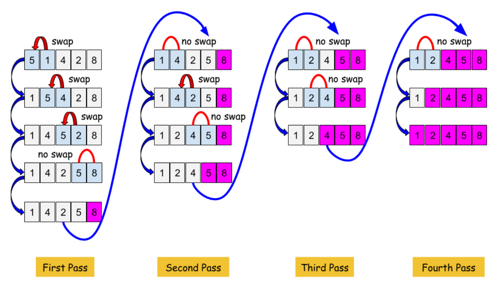

# Bubble sort

In this activity, the challenge is to create a function that sorts an array using the bubble sort method.

## Details

We will be writing code in the body of the `bubbleSort` function to achieve the following:

- sort the numbers in the given array in ascending order.
- return the sorted array.

To achieve this, the bubble sort method proceeds as follow:

- 1st step: we move down the array comparing a pair of items and swapping them if needed so that they end up in ascending order. This results in moving the largest number to the end of the array (in pink on below pic)
- 2nd step: we repeat the 1st step a number of times (max equal to the length of the array). This means that each pass brings the remaining largest number to its correct index, until position 0 which now holds the smallest number.



## Expected test results

See the following given unsorted array for an example:

```js
const arr = [10, 20, 9, 6, 3];
```

Given the preceding array, the following sorted array should be returned:

```js
const sortedArr = [3, 6, 9, 10, 20];
```

See the following given unsorted array for an example:

```js
const arr = [10];
```

Given the preceding array, the following sorted array should be returned:

```js
const sortedArr = [10];
```

See the following given unsorted array for an example:

```js
const arr = [];
```

Given the preceding array, the following sorted array should be returned:

```js
const sortedArr = [];
```
