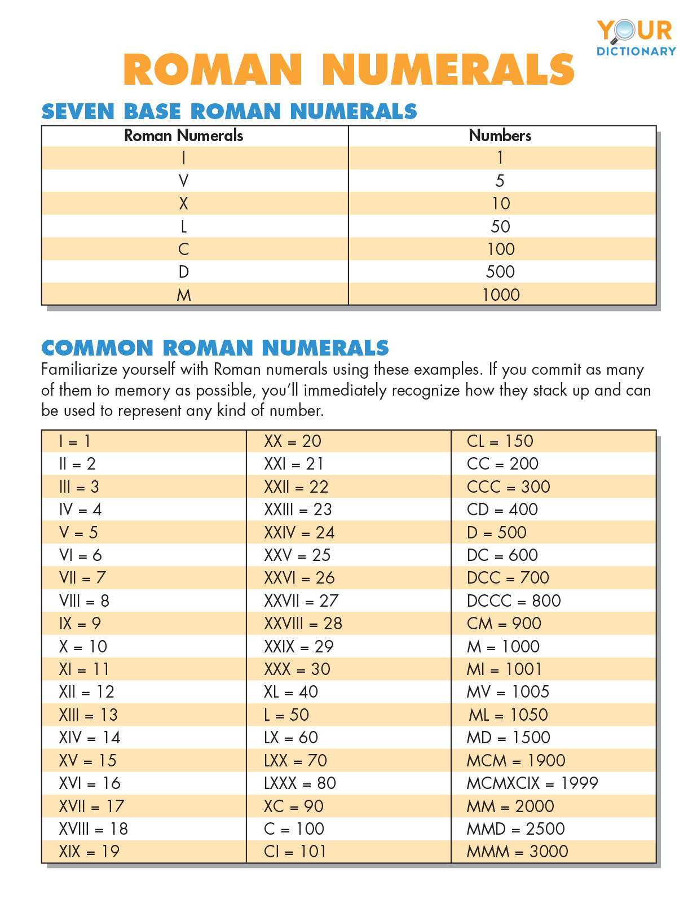

# Roman to Integer

In this activity, the challenge is to create a function that takes in a Roman numeral string and returns its integer form.

## Basic rules of roman numbers

### Base roman numerals and Common roman numerals



### How to read the roman numbers

The position of the letters I, V, X, L, C, and D is what determines the value of the actual Roman numeral. An I in the wrong place can be the difference between 9 and 11, or even 99 and 101.

More rules for understanding Roman numbers include:

- If smaller numbers follow larger numbers, add the numbers.For example: In the Roman numeral XII, you add 10, 1, and 1, which makes 12.
- If a smaller number precedes a larger number, subtract the smaller number.For example: In the Roman numeral IV, you subtract calls 1 from 5, which makes 4.
- Roman numerals don't use four identical letters in a row. For example: You'd never exceed XXX, or 10+10+10, for the tens placement. Since we can't use four identical numerals in a row, 40 would not be XXXX but, rather, XL.
- Any time you see a line, that indicates the number should be multiplied by a thousand.For example: When V looks like V̅, that indicates 5 x 1000 = 5000.
- Remember to treat each part of the number separately (ones, tens, hundreds, etc.).
  For example: Even though 1999 is one fewer than 2000, you write MCMXCIX instead of MIM because you can’t skip place value.
- You can use either capital or lowercase letters to write Roman numerals.For example: XVI and xvi both mean 16.
- As you add more numbers, the math gets more and more important, but not much more complicated. Read on to learn more about translating Roman numbers.

## Details

We will be writing code in the body of the `roman` function to achieve the following: read the roman number and return the corresponding integer.

See the following array for an example:

```js
const roman = "V";
```

Given the preceding roman string, the following result should be returned:

```js
const result = 5;
```

See the following array for an example:

```js
const roman = "IX";
```

Given the preceding roman string, the following result should be returned:

```js
const result = 9;
```

See the following array for an example:

```js
const roman = "MMXXIV";
```

Given the preceding roman string, the following result should be returned:

```js
const result = 2024;
```
